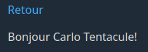
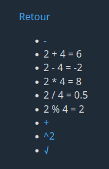
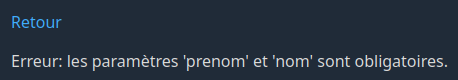
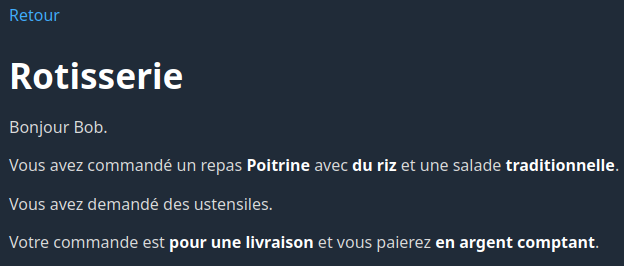

# Laboratoire 01

## Objectif

Vous familiariser avec les notions de base de PHP. Le laboratoire est divisé en deux parties couvrant respectivement la matière des deux premiers cours:

### Partie 1

* Les variables
* Les opérateurs arithmétiques
* L'opérateur de concaténation
* Lecture de données transmises par l'URL

### Partie 2

* Les structures conditionnelles
* Les opérateurs logiques

## Prérequis

Clonez ce dépôt à la racine du répertoire contenant les fichiers Web de votre installation Xampp. Utilisez ensuite un navigateur Web pour accéder à l'adresse `/lab01` sur votre serveur local (ex: `http://localhost/lab01` ou `http://localhost:8080/lab01`).

Vous devriez voir une page avec le titre « Laboratoire 01 » suivi d'une liste de liens.

Ouvrez ensuite le dossier `lab01` dans Visual Studio Code.

## Partie 1

Cette partie utilise les 5 pages Web suivantes:

* index.html
* concatenation.php
* precedent_suivant.php
* arithmetique.php
* fibonacci.php

### 1.1 - Concaténation

Dans votre navigateur, cliquez sur **Concaténation**. Vous devriez voir une page contenant seulement un lien de retour.

Regardez dans la barre d'adresse. Vous constaterez que le fichier PHP correspondant à la page est `concatenation.php` et que deux **paramètres** ont été passés dans l'URL: `prenom=Carlo` et `nom=Tentacule`.

Accédez au fichier `concatenation.php` dans votre IDE (Visual Studio Code).

Ajoutez les lignes de code suivante au tout début du fichier (au-dessus de la balise `<html>`):

```php
<?php

$prenom = $_GET['prenom'];
$nom = $_GET['nom'];
$bonjour = "Bonjour $prenom $nom!";

?>
```

Ces lignes de code prennent le prénom et le nom dans l'URL, puis les **concatènent** à l'intérieur de la variable `$bonjour`, en les précédant du texte `Bonjour `, et en les suivant du caractère `!`. Pour les valeurs `Carlo` et `Tentacule`, le résultat sera `Bonjour Carlo Tentacule!`.

Une autre façon de faire la même chose aurait été la suivante:

```php
$bonjour = 'Bonjour ' . $prenom . ' ' .  $nom . '!';
```

Actualisez la page dans votre navigateur. Que remarquez-vous?

Rien bien sûr! La page n'a pas changé, puisque nous n'y avons rien affiché de nouveau. Nous avons simplement manipulé des variables.

Référez-vous aux exemples vus en classe pour afficher le contenu de la variable `$bonjour` sous le lien `Retour`. Voici un aperçu du résultat que vous devriez obtenir avec les valeurs actuelles:



Une fois que votre page fonctionne, changez les valeurs passées dans l'URL et observez le résultat. Le texte affiché à l'écran devrait changer.

### 1.2 - Précédent-Suivant

Dans votre navigateur, retournez à la page d'accueil en cliquant sur **Retour**. Accédez ensuite à la page **Précédent-Suivant**.

Regardez dans la barre d'adresse. Vous remarquerez que le fichier PHP correspondant à la page est `precedent_suivant.php`, et qu'un paramètre `nombre` a été passé dans l'URL.

Accédez au fichier `precedent_suivant.php` dans votre IDE.

Vous devez modifier ce fichier afin d'ajouter le contenu suivant sur la page:


Pour ce faire, commencez par ajouter le code suivant au début du fichier:

```php
<?php

$nombre = $_GET['nombre'];
$nombrePrecedent = $_GET['nombre'] - 1;
$nombreSuivant = $nombre + 1;

?>
```

Ce code crée d'abord une variable `$nombre` contenant le paramètre `nombre` passé dans l'URL. Il crée ensuite une variable `$nombrePrecedent` contenant le nombre qui précède `$nombre`, et une variable `$nombreSuivant` contenant le nombre qui le suit.

Modifiez maintenant le contenu du `body` afin d'afficher la liste des trois nombres. Le premier élément de la liste doit être un lien vers la même page, avec `$nombrePrecedent` passé comme valeur du paramètre `nombre`. Le troisième élément doit faire la même chose avec le nombre suivant.

### 1.3 - Arithmétique

Dans votre navigateur, retournez à la page d'accueil en cliquant sur **Retour**. Accédez ensuite à la page **Arithmétique**.

Regardez dans la barre d'adresse. Vous remarquerez que le fichier PHP correspondant à la page est `arithmetique.php`, et que deux paramètres ont été passés dans l'URL: `a=2` et `b=4`.

Accédez au fichier `arithmetique.php` dans votre IDE.

Vous devez modifier ce fichier afin d'ajouter le contenu suivant sur la page:



Voici le comportement attendu de la page:

* Les deuxième à sixième éléments de la liste à puces doivent montrer respectivement l'addition, la soustraction, la multiplication, la division et le modulo des deux variables reçues dans l'URL.
* Le symbole `-` du premier élément de la liste doit être un lien vers la même page, mais avec les paramètres décrémentés de 1. Par exemple, si `a` vaut 2 et que `b` vaut 4, leurs nouvelles valeurs seront 1 et 3 respectivement.
* L'élément avec le symbole `+` est un lien semblable au `-`, mais qui incrémente chaque paramètre de 1 au lieu de le décrémenter.
* L'élément `^2` met au carré chacun des deux paramètres.
* L'élément `√` remplace chacun des deux paramètres par sa racine.

Référez-vous aux exemples vus en classe pour répondre à la demande.

Le code pour calculer le carré d'une variable `$a` est le suivant:

`$aCarre = $a ** 2;`

Le code pour calculer la racine carrée d'une variable `$a` est le suivant:

`$racineA = sqrt($a);`

### 1.4 - Fibonacci

La suite de Fibonacci est une suite mathématique dans laquelle chaque nombre est la somme des deux nombres précédents. Ses 7 premiers éléments sont les suivants:

* 0
* 1
* 1
* 2
* 3
* 5
* 8

Les deux premiers éléments sont 0 et 1, puis le troisième élément est 1 (soit la somme de 0 et 1), suivi de 2 (1 + 1), puis de 3 (1 + 2), puis de 5 (2 + 3), et ainsi de suite.

[Suite de Fibonacci sur Wikipédia](https://fr.wikipedia.org/wiki/Suite_de_Fibonacci)

Dans votre navigateur, retournez à la page d'accueil en cliquant sur **Retour**. Accédez ensuite à la page **Fibonacci**.

Regardez dans la barre d'adresse. Vous remarquerez que le fichier PHP correspondant à la page est `fibonacci.php`, et que deux paramètres ont été passés dans l'URL: `n1=0` et `n2=1`. Comme vous pouvez voir, les deux valeurs correspondent aux deux premiers éléments de la suite de Fibonacci.

Accédez au fichier `fibonacci.php` dans votre IDE.

Vous devez modifier la page de façon à produire l'affichage suivant:


Le nombre affiché doit être le nombre qui suit `n1` et `n2` dans la suite de Fibonacci. Chaque fois qu'on clique sur le lien `>`, on doit obtenir le nombre suivant dans la suite. Donc, dans notre exemple, si on clique 5 fois sur le lien, nous obtiendrons les valeurs suivantes:

* 2
* 3
* 5
* 8
* 13

Vous devez parvenir à ce résultat en utilisant chaque fois **uniquement** les paramètres `n1` et `n2`.

Comparez votre code de la partie 1 avec celui de la solution avant de passer à la partie 2.

## Partie 2

Pour faire cette partie, vous devez avoir vu la matière du cours 2 sur les structures conditionnelles.

Cette partie utilise les pages Web suivantes:

* index.html
* concatenation.php
* precedent_suivant.php
* arithmetique.php
* fibonacci.php
* rotisserie.php

### 2.1 - Validation de la présence des paramètres de la partie 1

Retournez sur la page **Concaténation** dans votre navigateur. Retirez les paramètres `prenom` et `nom` dans la barre d'adresse, puis faites charger la page de nouveau. Que remarquez-vous?

Il serait bien de détecter lorsque les paramètres sont manquants, et d'afficher un message d'erreur en conséquence. Pour ce faire, modifiez le code au début de la page de la façon suivante:

```php
<?php

$erreur = false;

if (isset($_GET['prenom']) && isset($_GET['nom'])) {
    $prenom = $_GET['prenom'];
    $nom = $_GET['nom'];
    $bonjour = "Bonjour $prenom $nom!";
} else {
    $erreur = true;
}

?>
```

Puis modifiez le `body` de la manière suivante:

```php
<body>
    <nav>
        <a href="index.html">Retour</a>
    </nav>       
    <p>
        <?php

        if ($erreur) {
            echo "Erreur: les paramètres 'prenom' et 'nom' sont obligatoires.";
        } else {
            echo $bonjour;
        }

        ?>
    </p>
</body>
```

Rechargez la page. Vous devriez maintenant voir le contenu suivant:



Remettez les paramètres `prenom` et `nom`. La page devrait maintenant s'afficher comme avant.

De la même façon, modifiez le code au début de `precedent_suivant.php` ainsi:

```php
<?php

$erreur = false;

if (!isset($_GET['nombre'])) {
    $erreur = true;
} else {
    $nombre = $_GET['nombre'];
    $nombrePrecedent = $_GET['nombre'] - 1;
    $nombreSuivant = $nombre + 1;
}

?>
```

Adaptez ensuite le `body`. Cette fois-ci, puisqu'il y a plusieurs lignes de HTML à afficher, il serait avantageux de fermer la balise PHP au début du `else`, puis de la réouvrir à la fin. Par exemple:

```php
<body>
    <nav>
        <a href="index.html">Retour</a>
    </nav>
    <?php

    if ($erreur) {
        echo "<p>Erreur: le paramètre 'nombre' est manquant.</p>";
        exit;
    } else {
    ?>

        <ul>
            <li><a href="?nombre=<?= $nombrePrecedent; ?>"><?= $nombrePrecedent; ?></a></li>
            <li><?= $nombre; ?></li>
            <li><a href="?nombre=<?= $nombreSuivant; ?>"><?= $nombreSuivant; ?></a></li>
        </ul>        

    <?php
    }

    ?>
</body>
```

Une autre façon de gérer l'erreur aurait été d'utiliser l'instruction `exit` pour arrêter l'interprétation du code dès qu'une erreur est détectée. C'est ce que nous allons faire pour la page `arithmetique.php`.

Présentement, vous avez probablement du code PHP au début du fichier. Par exemple:

```php
<?php

$a = $_GET['a'];
$b = $_GET['b'];

// (votre code qui fait les calculs)

?>
```

Vous pourriez placer ce code dans un `if (isset(...) && ...)`, puis traiter l'erreur directement dans le `else` avec un `exit`. Cela ressemblerait à ceci:

```php
<?php

if (isset($_GET['a']) && isset($_GET['b'])) {
    $a = $_GET['a'];
    $b = $_GET['b'];

    // (votre code qui fait les calculs)
} else {
    echo "Erreur: Les paramètres 'a' et 'b' sont obligatoires.";
    exit;
}

?>
```

Adaptez votre code de cette façon, puis testez votre détection d'erreur. Que remarquez-vous?

La page a perdu son titre (`<title>`) et son style! Si vous affichez le code source de la page dans votre navigateur, vous comprendrez pourquoi.

Voyez-vous, PHP ne fait rien d'autre que générer du HTML et l'envoyer au navigateur. Dans ce cas-ci, tout ce que nous avons envoyé au navigateur, c'est un message d'erreur, avec aucune balise HTML. Ce n'est pas ce que nous voulons!

Une première solution possible serait d'ajouter du HTML de base directement dans le `else`:

```php
if (isset($_GET['a']) && isset($_GET['b'])) {
    $a = $_GET['a'];
    $b = $_GET['b'];

    // (votre code qui fait les calculs)
} else {
    ?>

    <!DOCTYPE html>
    <html lang="fr">
    <head>
        <meta charset="UTF-8">
        <meta name="viewport" content="width=device-width, initial-scale=1.0">
        <title>Laboratoire 01</title>
        <link rel="stylesheet" href="water.css">
    </head>
    <body>
        <nav>
            <a href="index.html">Retour</a>
        </nav>     
        <p>Erreur: Les paramètres 'a' et 'b' sont obligatoires.</p>
    </body>
    </html>
    
    <?php

    exit;
}
```

Le problème avec cette approche c'est que nous répétons le code HTML de base à deux endroits sur la page. Ça fait donc du code à maintenir en double si jamais on veut changer le titre de la page, la feuille de style liée, etc. Nous voulons éviter cela.

Une meilleure solution serait donc de déplacer notre code directement dans le `body`:

```php
<!DOCTYPE html>
<html lang="fr">
<head>
    <meta charset="UTF-8">
    <meta name="viewport" content="width=device-width, initial-scale=1.0">
    <title>Laboratoire 01</title>
    <link rel="stylesheet" href="water.css">
</head>
<body>
    <nav>
        <a href="index.html">Retour</a>
    </nav>

    <?php

    if (isset($_GET['a']) && isset($_GET['b'])) {
        $a = $_GET['a'];
        $b = $_GET['b'];

        // (votre code qui fait les calculs)
    } else {
        echo "<p>Erreur: Les paramètres 'a' et 'b' sont obligatoires.</p>";
        echo '</body></html>';
        exit;
    }

    ?>

    <ul>
        <li><a href="?a=<?= $aPrecedent; ?>&b=<?= $bPrecedent; ?>">-</a></li>
        <li><?= $a ?> + <?= $b ?> = <?= $addition ?></li>
        <li><?= $a ?> - <?= $b ?> = <?= $soustraction ?></li>
        <li><?= $a ?> * <?= $b ?> = <?= $multiplication ?></li>
        <li><?= $a ?> / <?= $b ?> = <?= $division ?></li>
        <li><?= $a ?> % <?= $b ?> = <?= $modulo ?></li>
        <li><a href="?a=<?= $aSuivant; ?>&b=<?= $bSuivant; ?>">+</a></li>
        <li><a href="?a=<?= $aCarre; ?>&b=<?= $bCarre; ?>">^2</a></li>
        <li><a href="?a=<?= $racineA; ?>&b=<?= $racineB; ?>">√</a></li>
    </ul>
</body>
</html>
```

Remarquez qu'il faut tout de même fermer les balises `body` et `html` avant de faire le `exit`, mais ça reste du code beaucoup moins répétitif que dans la version précédente.

Nous aurions aussi pu inverser notre condition de façon à avoir seulement un `if` pour le cas d'erreur, sans `else`:

```php
<!DOCTYPE html>
<html lang="fr">
<head>
    <meta charset="UTF-8">
    <meta name="viewport" content="width=device-width, initial-scale=1.0">
    <title>Laboratoire 01</title>
    <link rel="stylesheet" href="water.css">
</head>
<body>
    <nav>
        <a href="index.html">Retour</a>
    </nav>

    <?php

    if (!isset($_GET['a']) || !isset($_GET['b'])) {
        echo "<p>Erreur: Les paramètres 'a' et 'b' sont obligatoires.</p>";
        echo '</body></html>';
        exit;
    } 
    
    // (votre code qui fait les calculs)

    ?>

    <ul>
        <li><a href="?a=<?= $aPrecedent; ?>&b=<?= $bPrecedent; ?>">-</a></li>
        <li><?= $a ?> + <?= $b ?> = <?= $addition ?></li>
        <li><?= $a ?> - <?= $b ?> = <?= $soustraction ?></li>
        <li><?= $a ?> * <?= $b ?> = <?= $multiplication ?></li>
        <li><?= $a ?> / <?= $b ?> = <?= $division ?></li>
        <li><?= $a ?> % <?= $b ?> = <?= $modulo ?></li>
        <li><a href="?a=<?= $aSuivant; ?>&b=<?= $bSuivant; ?>">+</a></li>
        <li><a href="?a=<?= $aCarre; ?>&b=<?= $bCarre; ?>">^2</a></li>
        <li><a href="?a=<?= $racineA; ?>&b=<?= $racineB; ?>">√</a></li>
    </ul>
</body>
</html>
```

Assurez-vous de bien comprendre la condition dans les deux cas.

Nous avons vu plusieurs façons de coder la même validation. Choisissez celle que vous préférez pour faire l'équivalent dans `fibonacci.php`. Testez votre code rigoureusement.

### 2.2 - Validation des paramètres numériques

Nous avons amélioré nos scripts de la partie 1 en ajoutant quelques validations, mais il en manque encore.

Retournez sur la page **Précédent-Suivant**. Que se passe-t-il si vous remplacer la valeur du paramètre `nombre` par `bonjour` ?

Vous obtenez une erreur, parce qu'on ne peut pas effectuer d'opérations mathématiques sur `bonjour` !

Il faut donc ajouter des validations supplémentaires pour vérifier que les paramètres reçus sont numériques.

En PHP, il est possible de vérifier qu'une variable `$a` est numérique de la façon suivante:

`if (is_numeric($a))`

Adaptez le code de **precedent_suivant.php** de façon à afficher un message d'erreur approprié si le nombre reçu en paramètre n'est pas numérique. Testez ensuite votre code rigoureusement. Lorsque tout fonctionne, faites la même chose pour **Arithmétique** et **Fibonacci**.

### 2.3 - Rotisserie

Retournez à la page d'accueil et cliquez sur **Rotisserie**.

Si vous regardez dans la barre d'adresse, vous constaterez que le fichier correspondant à cette page est `rotisserie.php` et que les paramètres suivants sont passés dans l'URL:

* `prenom=Bob`
* `repas=1`
* `accompagnement=2`
* `salade=2`
* `ustensiles=0`
* `type=1`
* `paiement=1`

Le contenu à générer pour ces paramètres est le suivant:



Vous l'avez deviné, il s'agit d'une page qui simule une commande de poulet dans une rotisserie!

Voici les règles à respecter dans la programmation de la page:

* Tous les paramètres doivent être validés.
* Les valeurs possibles pour le paramètre `repas` sont `1` et `2`. La valeur `1` signifie **Poitrine** et la valeur `2` signifie **Cuisse**.
* Les valeurs possibles pour le paramètre `accompagnement` sont `1` et `2`. La valeur `1` signifie **frites** et la valeur `2` signifie **riz**.
* Les valeurs possibles pour `salade` sont `1` et `2`. La valeur `1` signifie **crémeuse** et la valeur `2` signifie **traditionnelle**.
* Les valeurs possibles pour `ustensiles` sont `0` et `1`. La valeur `0` signifie que le client n'a pas besoin d'ustensiles, et la valeur `1` signifie qu'il veut des ustensiles.
* Les valeurs possibles pour `type` sont `1` et `2`. La valeur `1` signifie que la commande est pour une livraison, et la valeur `2` signifie qu'il s'agit d'une commande pour emporter.
* Le paramètre `paiement` est obligatoire uniquement si le type de commande est une livraison. Dans ce cas, une valeur de `paiement` de `1` signifie un paiement en argent comptant, et une valeur de `2` signifie un paiement par carte. Si le type de commande est pour emporter, la page ne doit pas afficher le type de paiement.

Bonne chance!

Testez votre code rigoureusement. Lorsque vous avez terminé, comparez votre code avec celui de la solution.
