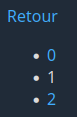

# Laboratoire 01

## Objectif

Vous familiariser avec les notions de base de PHP. Le laboratoire est divisé en deux parties couvrant respectivement la matière des deux premiers cours:

### Partie 1

* Les variables
* Les opérateurs arithmétiques
* L'opérateur de concaténation
* Lecture de données transmises par l'URL

### Partie 2

* Les structures conditionnelles
* Les opérateurs logiques

## Prérequis

Clonez ce dépôt à la racine du répertoire contenant les fichiers Web de votre installation Xampp. Utilisez ensuite un navigateur Web pour accéder à l'adresse `/lab01` sur votre serveur local (ex: `http://localhost/lab01` ou `http://localhost:8080/lab01`).

Vous devriez voir une page avec le titre « Laboratoire 01 » suivi d'une liste de liens.

Ouvrez ensuite le dossier `lab01` dans Visual Studio Code.

## Partie 1

Cette partie utilise les 5 pages Web suivantes:

* index.html
* concatenation.php
* precedent_suivant.php
* arithmetique.php
* fibonacci.php

### 1.1 - Concaténation

Dans votre navigateur, cliquez sur **Concaténation**. Vous devriez voir une page contenant seulement un lien de retour.

Regardez dans la barre d'adresse. Vous constaterez que le fichier PHP correspondant à la page est `concatenation.php` et que deux **paramètres** ont été passés dans l'URL: `prenom=Carlo` et `nom=Tentacule`.

Accédez au fichier `concatenation.php` dans votre IDE (Visual Studio Code).

Ajoutez les lignes de code suivante au tout début du fichier (au-dessus de la balise `<html>`):

```php
<?php

$prenom = $_GET['prenom'];
$nom = $_GET['nom'];
$bonjour = "Bonjour $prenom $nom!";

?>
```

Ces lignes de code prennent le prénom et le nom dans l'URL, puis les **concatènent** à l'intérieur de la variable `$bonjour`, en les précédant du texte `Bonjour `, et en les suivant du caractère `!`. Pour les valeurs `Carlo` et `Tentacule`, le résultat sera `Bonjour Carlo Tentacule!`.

Une autre façon de faire la même chose aurait été la suivante:

```php
$bonjour = 'Bonjour ' . $prenom . ' ' .  $nom . '!';
```

Actualisez la page dans votre navigateur. Que remarquez-vous?

Rien bien sûr! La page n'a pas changé, puisque nous n'y avons rien affiché de nouveau. Nous avons simplement manipulé des variables.

Référez-vous aux exemples vus en classe pour afficher le contenu de la variable `$bonjour` sous le lien `Retour`. Voici un aperçu du résultat que vous devriez obtenir avec les valeurs actuelles:


Une fois que votre page fonctionne, changez les valeurs passées dans l'URL et observez le résultat. Le texte affiché à l'écran devrait changer.

### 1.2 - Précédent-Suivant

Dans votre navigateur, retournez à la page d'accueil en cliquant sur **Retour**. Accédez ensuite à la page **Précédent-Suivant**.

Regardez dans la barre d'adresse. Vous remarquerez que le fichier PHP correspondant à la page est `precedent_suivant.php`, et qu'un paramètre `nombre` a été passée dans l'URL.

Accédez au fichier `precedent_suivant.php` dans votre IDE.

Vous devez modifier ce fichier afin d'ajouter le contenu suivant sur la page:



Pour ce faire, commencez par ajouter le code suivant au début du fichier:

```php
<?php

$nombre = $_GET['nombre'];
$nombrePrecedent = $_GET['nombre'] - 1;
$nombreSuivant = $nombre + 1;

?>
```

Ce code crée d'abord une variable `$nombre` contenant le paramètre `nombre` passé dans l'URL. Il crée ensuite une variable `$nombrePrecedent` contenant le nombre qui précède `$nombre`, et une variable `$nombreSuivant` contenant le nombre qui le suit.

Modifiez maintenant le contenu du `body` afin d'afficher la liste des trois nombres. Le premier élément de la liste doit être un lien vers la même page, avec `$nombrePrecedent` passé comme valeur du paramètre `nombre`. Le troisième élément doit faire la même chose avec le nombre suivant.

### 1.3 - Arithmétique

Dans votre navigateur, retournez à la page d'accueil en cliquant sur **Retour**. Accédez ensuite à la page **Arithmétique**.

Regardez dans la barre d'adresse. Vous remarquerez que le fichier PHP correspondant à la page est `arithmetique.php`, et que deux paramètres ont été passés dans l'URL: `a=2` et `b=4`.

Accédez au fichier `arithmetique.php` dans votre IDE.

Vous devez modifier ce fichier afin d'ajouter le contenu suivant sur la page:


Voici le comportement attendu de la page:

* Les deuxième à sixième éléments de la liste à puces doivent montrer respectivement l'addition, la soustraction, la multiplication, la division et le modulo des deux variables reçues dans l'URL.
* Le symbole `-` du premier élément de la liste doit être un lien vers la même page, mais avec les paramètres décrémentés de 1. Par exemple, si `a` vaut 2 et que `b` vaut 4, leurs nouvelles valeurs seront 1 et 3 respectivement.
* L'élément avec le symbole `+` est un lien semblable au `-`, mais qui incrémente chaque paramètre de 1 au lieu de le décrémenter.
* L'élément `^2` met au carré chacun des deux paramètres.
* L'élément `√` remplace chacun des deux paramètres par sa racine.

Référez-vous aux exemples vus en classe pour répondre à la demande.

Le code pour calculer le carré d'une variable `$a` est le suivant:

`$aCarre = $a ** 2;`

Le code pour calculer la racine carrée d'une variable `$a` est le suivant:

`$racineA = sqrt($a);`

### 1.4 - Fibonacci

La suite de Fibonacci est une suite mathématique dans laquelle chaque nombre est la somme des deux nombres précédents. Ses 7 premiers éléments sont les suivants:

* 0
* 1
* 1
* 2
* 3
* 5
* 8

Les deux premiers éléments sont 0 et 1, puis le troisième élément est 1 (soit la somme de 0 et 1), suivi de 2 (1 + 1), puis de 3 (1 + 2), puis de 5 (2 + 3), et ainsi de suite.

[Suite de Fibonacci sur Wikipédia](https://fr.wikipedia.org/wiki/Suite_de_Fibonacci)

Dans votre navigateur, retournez à la page d'accueil en cliquant sur **Retour**. Accédez ensuite à la page **Fibonacci**.

Regardez dans la barre d'adresse. Vous remarquerez que le fichier PHP correspondant à la page est `fibonacci.php`, et que deux paramètres ont été passés dans l'URL: `n1=0` et `n2=1`. Comme vous pouvez voir, les deux valeurs correspondent aux deux premiers éléments de la suite de Fibonacci.

Accédez au fichier `fibonacci.php` dans votre IDE.

Vous devez modifier la page de façon à produire l'affichage suivant:


Le nombre affiché doit être le nombre qui suit `n1` et `n2` dans la suite de Fibonacci. Chaque fois qu'on clique sur le lien `>`, on doit obtenir le nombre suivant dans la suite. Donc, dans notre exemple, si on clique 5 fois sur le lien, nous obtiendrons les valeurs suivantes:

* 2
* 3
* 5
* 8
* 13

Vous devez parvenir à ce résultat en utilisant chaque fois **uniquement** les paramètres `n1` et `n2`.
